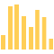
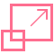

Chart.js
========

Simple yet flexible JavaScript charting for designers & developers
------------------------------------------------------------------

<a href="./docs" class="button button__red">Get Started</a> <a href="./docs/latest/samples" class="button button__blue">Samples</a> <a href="https://github.com/chartjs/awesome" class="button button__teal">Ecosystem</a> <a href="https://github.com/chartjs/Chart.js" class="button button__black">GitHub</a>

------------------------------------------------------------------------

### New in 2.0 Mixed chart types

Mix and match bar and line charts to provide a clear visual distinction between datasets.

### New in 2.0 New chart axis types

Plot complex, sparse datasets on date time, logarithmic or even entirely custom scales with ease.

### New in 2.0 Animate everything!

Out of the box stunning transitions when changing data, updating colours and adding datasets.

------------------------------------------------------------------------

#### Open source

Chart.js is a community maintained project, contributions welcome!

#### 8 Chart types

Visualize your data in 8 different ways; each of them animated and customisable.

#### HTML5 Canvas

Great rendering performance across all modern browsers (IE11+).

#### Responsive

Redraws charts on window resize for perfect scale granularity.

------------------------------------------------------------------------

[Find Chart.js on GitHub](https://github.com/chartjs/Chart.js) or [Read detailed documentation](./docs)
-------------------------------------------------------------------------------------------------------

Chart.js was built from the hard work of all [these contributors.](https://github.com/chartjs/Chart.js/contributors)
