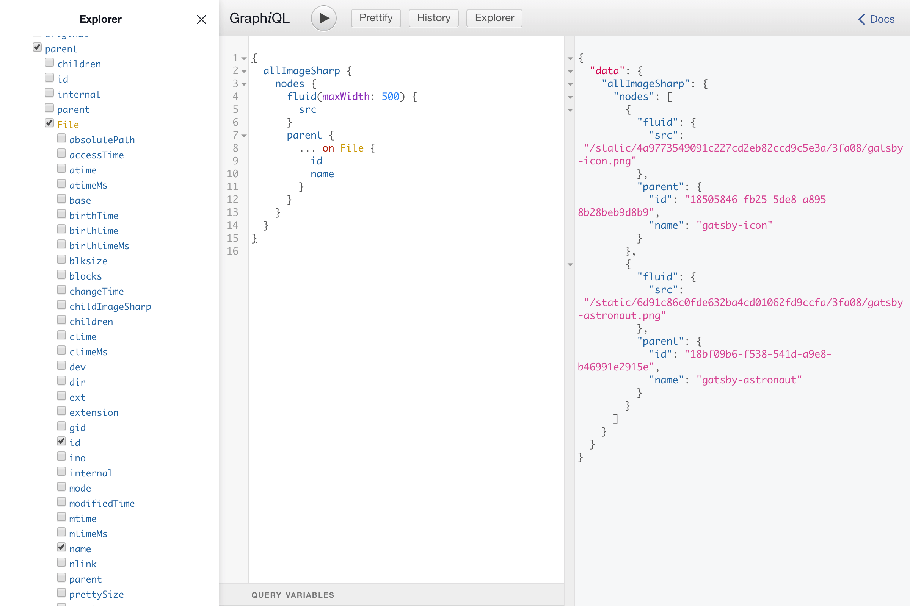

gatsby-graphiql-explorer
========================

A package to extend the default [GraphiQL](https://github.com/graphql/graphiql) IDE with useful features for Gatsby users.

*Note:* accessible at `http://localhost:8000/___graphql` after running `gatsby develop`

Features
--------

-   Offline support - for when you need to work on your excellent Gatsby app on a plane, train, or elsewhere off the grid
-   [GraphiQL Explorer](https://github.com/OneGraph/graphiql-explorer) - an interactive explorer plugin to visually create and interact with the GraphQL schema
-   Support for implied fragments - whether provided by you, core or plugins. Autocompletion, validation & operation execution are all covered!
-   *All* the expected features you know and love from [GraphiQL](https://github.com/graphql/graphiql)
