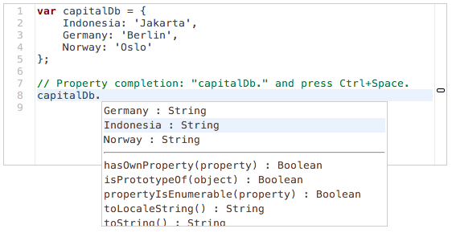

- # [Esprima](../index.html)

- - [Demo](../demo/index.html)
  - Static Analysis
  - [Online Parsing](../demo/parse.html)
  - [Syntax Validator](../demo/validate.html)
  - [Operator Precedence](../demo/precedence.html)
  - [Regex Collector](../demo/collector.html)
  - Dynamic Tracing
  - [Function Instrumentation](../demo/functiontrace.html)
  - Code Transformation
  - [Source Rewrite](../demo/rewrite.html)
  - [Minifiy & Obfuscate](../demo/minify.html)
  - Editing Tools
  - [Identifier Highlight](../demo/highlight.html)
  - [Rename Refactoring](../demo/rename.html)
  - [Autocomplete](../demo/autocomplete.html)
- [Project](#)

  - [Git Repository](http://github.com/ariya/esprima)
  - [Continuous Integration](https://travis-ci.org/ariya/esprima)
  - [Mailing List](http://groups.google.com/group/esprima)
  - [Issue Tracker](http://issues.esprima.org/)
  - - QA
  - [Unit Tests](../test/index.html)
  - [Benchmarks Suite](../test/benchmarks.html)
  - [Compatibility Tests](../test/compat.html)
  - [Speed Comparison](../test/compare.html)
  - [Module Loading](../test/module.html)
  - [Coverage Analysis](../test/coverage.html)

- [Documentation](../doc/index.html)

### **Demos** are worth a thousand words

#### Static Analysis

Once Esprima produces the [abstract syntax tree](http://en.wikipedia.org/wiki/Abstract_syntax_tree) (AST), various types of static analysis can give a useful insight. The code can be seen from a different perspective via a syntax [visualization](parse.html). For testing purposes, it can be checked against the language specification using the code [validator](validate.html).

Other analysis tools:

- Scan and spot [regular expressions](collector.html)
- Equivalency of different [operator precedences](precedence.htm)

#### Dynamic Tracing

Analyzing the run-time behavior is essential to ensure a consistent application performance. One practical usage is by monitoring the [function execution](functiontrace.html), it will reveal how many times each function is being invoked.

#### Code Transformation

Regenerative transformation is made possibly by recreating the code from its AST. This permits both [source rewriting](rewrite.html) (following particular coding style) as well as [code minification](minify.html) (for size reduction).

#### Editing Tools

Semantic information about the code (as being edited) can be used to give an important assistance, from a simple [identifier highlighting](highlight.html) to a more complex intelligent [autocompletion](autocomplete.html).

Esprima is created and mantained by [Ariya Hidayat](http://ariya.ofilabs.com/about).

- [@Esprima](http://twitter.com/esprima)
- [GitHub](https://github.com/ariya/esprima)
