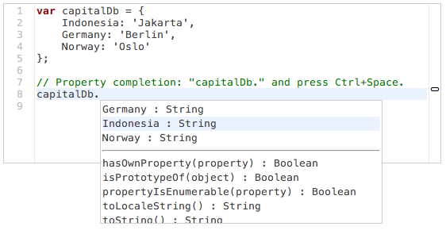

- # [Esprima](#)

- - [Demo](demo/index.html)
  - Static Analysis
  - [Online Parsing](demo/parse.html)
  - [Syntax Validator](demo/validate.html)
  - [Operator Precedence](demo/precedence.html)
  - [Regex Collector](demo/collector.html)
  - Dynamic Tracing
  - [Function Instrumentation](demo/functiontrace.html)
  - Code Transformation
  - [Source Rewrite](demo/rewrite.html)
  - [Minifiy & Obfuscate](demo/minify.html)
  - Editing Tools
  - [Identifier Highlight](demo/highlight.html)
  - [Rename Refactoring](demo/rename.html)
  - [Autocomplete](demo/autocomplete.html)
- [Project](#)

  - [Git Repository](http://github.com/ariya/esprima)
  - [Continuous Integration](https://travis-ci.org/ariya/esprima)
  - [Mailing List](http://groups.google.com/group/esprima)
  - [Issue Tracker](http://issues.esprima.org/)
  - - QA
  - [Unit Tests](test/index.html)
  - [Benchmarks Suite](test/benchmarks.html)
  - [Compatibility Tests](test/compat.html)
  - [Speed Comparison](test/compare.html)
  - [Module Loading](test/module.html)
  - [Coverage Analysis](test/coverage.html)

- [Documentation](doc/index.html)

### **ECMAScript** parsing infrastructure for multipurpose analysis

**Esprima** is a high performance, standard-compliant [ECMAScript](http://www.ecma-international.org/publications/standards/Ecma-262.htm) parser written in ECMAScript (also popularly known as [JavaScript](http://en.wikipedia.org/wiki/JavaScript)).

#### Features

- Full support for ECMAScript 5.1 ([ECMA-262](http://www.ecma-international.org/publications/standards/Ecma-262.htm))
- Sensible [syntax tree format](doc/index.html#ast), compatible with Mozilla [Parser AST](https://developer.mozilla.org/en/SpiderMonkey/Parser_API)
- Optional tracking of syntax node location (index-based and line-column)
- Heavily tested (&gt; 600 [tests](http://esprima.org/test/) with solid statement and branch coverage)
- Experimental support for ES6/Harmony (module, class, destructuring, ...)

Esprima serves as an important **building block** for some JavaScript language tools, from [code instrumentation](demo/functiontrace.html) to [editor autocompletion](demo/autocomplete.html).

Once the full syntax tree is obtained, various **static code analysis** can be applied to give an insight to the code: [syntax visualization](demo/parse.html), [code validation](demo/validate.html), [editing autocomplete](demo/autocomplete.html) (with type inferencing) and [many others](demo/index.html).

Regenerating the code from the syntax tree permits a few different types of **code transformation**, from a simple [rewriting](demo/rewrite.html) (with specific formatting) to a more complicated [minification](demo/minify.html).

Esprima runs on many popular web browsers, as well as other ECMAScript platforms such as [Rhino](http://www.mozilla.org/rhino) and [Node.js](https://npmjs.org/package/esprima). It is distributed under the [BSD license](https://github.com/ariya/esprima/blob/master/LICENSE.BSD).

Esprima is created and mantained by [Ariya Hidayat](http://ariya.ofilabs.com/about).

- [@Esprima](http://twitter.com/esprima)
- [GitHub](https://github.com/ariya/esprima)
