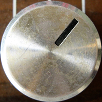
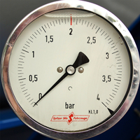

Test on Dials with different value ranges

     

-   
    Range is one revolution

    1

-   
    Range wraps around the dial one or more times

    2

-   
    Range is &lt; one revolution. The wrap point is in the range

    3

-   
    Range is &lt; one revolution. No wrap point in either the range nor out of range section

    4

-   
    Range is &lt; one revolution. wrap point found in out of range section

    5
