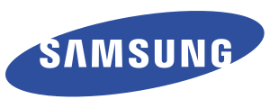

<a href="https://themes.3rdwavemedia.com/bootstrap-templates/startup/devconf-free-bootstrap-4-conference-template-for-tech-conferences-and-events/" class="btn btn-secondary">Tickets</a>

-   <a href="#about-section" class="nav-link scrollto">About</a>
-   <a href="#speakers-section" class="nav-link scrollto">Speakers</a>
-   <a href="#schedule-section" class="nav-link scrollto">Schedule</a>
-   <a href="#tickets-section" class="nav-link scrollto">Tickets</a>
-   <a href="#venue-section" class="nav-link scrollto">Venue</a>
-   <a href="#sponsors-section" class="nav-link scrollto">Sponsors</a>

DevConf 2022
============

12 - 15 Oct New York, USA

The \#1 Bootstrap 4 Template for  
Tech Conferences and Events.

<a href="https://themes.3rdwavemedia.com/bootstrap-templates/startup/devconf-free-bootstrap-4-conference-template-for-tech-conferences-and-events/" class="btn btn-primary btn-lg">Get Tickets</a>

2000+

Attendees

3

Days

60+

Talks

10+

Workshops

### About DevConf

Briefly introduce your conference or event here. You should convince people why they should attend with a list of benefits. **Are you a conference organizer? Want to source developer t-shirts as part of your conference package?** Check out our programming tees at [made4dev.com](https://made4dev.com/) - developers love them! Want to get a bulk discount or just want to use one of the t-shirt designs? Please email <hello@made4dev.com> and we can discuss.

#### Why Join Us

-   Unique chance to lorem ipsum dolor
-   Learn from the best in the industry
-   Discover the best tools and practices
-   Meet developers from all over the world
-   Grow your network
-   Practical workshops to lorem ipsum dolor
-   After-party lorem ipsum dolor
-   Free [developer t-shirts](https://made4dev.com) and swag

#### Event Starts In:

<a href="https://themes.3rdwavemedia.com/bootstrap-templates/startup/devconf-free-bootstrap-4-conference-template-for-tech-conferences-and-events/" class="btn btn-secondary btn-lg mb-5">Get Your Ticket Today</a>

#### Previously

Conference videos and images from previous years is a great way to show people what to expect at the conference and entice them to join. You can host more media content on YouTube, Flickr or Instagram and link out to them in this section.

### Speakers

List your featured speakers here. You can provide more info about each speaker in the relevant modal windows. Lorem ipsum dolor sit amet, consectetur adipiscing elit.

##### James Doe

Senior Software Developer

Angular Core Team

[Read more →](#modal-speaker-1)

-   
-   
-   

##### Sarah Doe

Developer Advocate

Google

[Read more →](#modal-speaker-1)

-   
-   
-   

##### Tim Doe

Software Developer

React Core Team

[Read more →](#modal-speaker-1)

-   
-   
-   

##### Josh Doe

Founder & CTO

Startup Week

[Read more →](#modal-speaker-1)

-   
-   
-   

##### Ling Doe

Software Architect

GitHub

[Read more →](#modal-speaker-1)

-   
-   
-   

##### Andy Doe

Senior Software Engineer

Twitter

[Read more →](#modal-speaker-1)

-   
-   
-   

##### Alice Doe

Senior Software Developer

Facebook

[Read more →](#modal-speaker-1)

-   
-   
-   

##### Thomas Doe

Lead Developer

Microsoft

[Read more →](#modal-speaker-1)

-   
-   
-   

<a href="https://themes.3rdwavemedia.com/bootstrap-templates/startup/devconf-free-bootstrap-4-conference-template-for-tech-conferences-and-events/" class="btn btn-primary btn-lg">Get Tickets</a>

------------------------------------------------------------------------

### Schedule

-   <a href="#tab-1-content" id="tab-1" class="nav-link active">Day 1 (Wed 12, Oct)</a>
-   <a href="#tab-2-content" id="tab-2" class="nav-link">Day 2 (Thu 13, Oct)</a>
-   <a href="#tab-3-content" id="tab-3" class="nav-link">Day 3 (Fri 14, Oct)</a>

#### 9:00 - 9:30

<a href="#modal-speaker-1" class="theme-link">James Doe</a>

### Best Practices And Tips For A Clean Angular Application

Conference Room A

Talk's summary goes here. **You can hook up the speaker profile image/name on the left with his or her bio modal window**. Lorem ipsum dolor sit amet, consectetur adipiscing elit. Fusce quis ornare nibh, pulvinar posuere justo. Aenean laoreet nunc a eleifend lacinia. Phasellus dignissim augue at consectetur ullamcorper.

#### 9:30 - 10:00

<a href="#modal-speaker-1" class="theme-link">Sarah Doe</a>

### Developer Productivity

Conference Room A

Talk's summary goes here. **You can hook up the speaker profile image/name on the left with his or her bio modal window**. Lorem ipsum dolor sit amet, consectetur adipiscing elit. Fusce quis ornare nibh, pulvinar posuere justo. Aenean laoreet nunc a eleifend lacinia. Phasellus dignissim augue at consectetur ullamcorper.

#### 10:00 - 10:30

### Coffee Break

Room A5

Coffee and cakes lorem ipsum dolor sit amet, consectetur adipiscing elit.

#### 10:30 - 11:00

<a href="#modal-speaker-1" class="theme-link">Tim Doe</a>

### Progressive Web Apps with React.js

Conference Room A

Talk's summary goes here. **You can hook up the speaker profile image/name on the left with his or her bio modal window**. Lorem ipsum dolor sit amet, consectetur adipiscing elit. Fusce quis ornare nibh, pulvinar posuere justo. Aenean laoreet nunc a eleifend lacinia. Phasellus dignissim augue at consectetur ullamcorper.

#### 11:00 - 12:00

<a href="#modal-speaker-1" class="theme-link">Josh Doe</a>

### Talk Title Lorem Ipsum

Conference Room B

Talk's summary goes here. **You can hook up the speaker profile image/name on the left with his or her bio modal window**. Lorem ipsum dolor sit amet, consectetur adipiscing elit. Fusce quis ornare nibh, pulvinar posuere justo. Aenean laoreet nunc a eleifend lacinia. Phasellus dignissim augue at consectetur ullamcorper.

#### 12:00 - 13:30

### Lunch Break

Room B6

Buffet lorem ipsum dolor sit amet, consectetur adipiscing elit.

#### 13:30 - 14:30

<a href="#modal-speaker-1" class="theme-link">Ling Doe</a>

### Talk Title Lorem Ipsum

Conference Room C

Talk's summary goes here. **You can hook up the speaker profile image/name on the left with his or her bio modal window**. Lorem ipsum dolor sit amet, consectetur adipiscing elit. Fusce quis ornare nibh, pulvinar posuere justo. Aenean laoreet nunc a eleifend lacinia. Phasellus dignissim augue at consectetur ullamcorper.

#### 14:30 - 15:30

<a href="#modal-speaker-1" class="theme-link">Andy Doe</a>

### Talk Title Lorem Ipsum

Conference Room C

Talk's summary goes here. **You can hook up the speaker profile image/name on the left with his or her bio modal window**. Lorem ipsum dolor sit amet, consectetur adipiscing elit. Fusce quis ornare nibh, pulvinar posuere justo. Aenean laoreet nunc a eleifend lacinia. Phasellus dignissim augue at consectetur ullamcorper.

#### 15:30 - 16:30

<a href="#modal-speaker-1" class="theme-link">Alice Doe</a>

### Talk Title Lorem Ipsum

Conference Room C

Talk's summary goes here. **You can hook up the speaker profile image/name on the left with his or her bio modal window**. Lorem ipsum dolor sit amet, consectetur adipiscing elit. Fusce quis ornare nibh, pulvinar posuere justo. Aenean laoreet nunc a eleifend lacinia. Phasellus dignissim augue at consectetur ullamcorper.

#### 16:30 - 17:30

<a href="#modal-speaker-1" class="theme-link">Thomas Doe</a>

### Talk Title Lorem Ipsum

Conference Room C

Talk's summary goes here. **You can hook up the speaker profile image/name on the left with his or her bio modal window**. Lorem ipsum dolor sit amet, consectetur adipiscing elit. Fusce quis ornare nibh, pulvinar posuere justo. Aenean laoreet nunc a eleifend lacinia. Phasellus dignissim augue at consectetur ullamcorper.

#### 18:00 - 24:00

### Dinner & After-party

Bar Lorem Ipsum

Lorem ipsum dolor sit amet, consectetur adipiscing elit. Fusce quis ornare nibh, pulvinar posuere justo. Aenean laoreet nunc a eleifend lacinia. Phasellus dignissim augue at consectetur ullamcorper.

#### Day 2 Agenda Coming Soon...

#### Day 3 Agenda Coming Soon...

<a href="https://themes.3rdwavemedia.com/bootstrap-templates/startup/devconf-free-bootstrap-4-conference-template-for-tech-conferences-and-events/" class="btn btn-primary btn-lg mr-md-2 d-block d-md-inline-block mb-3 mb-md-0">Download Schedule</a><a href="https://themes.3rdwavemedia.com/bootstrap-templates/startup/devconf-free-bootstrap-4-conference-template-for-tech-conferences-and-events/" class="btn btn-secondary btn-lg d-block d-md-inline-block">Buy Tickets</a>

### Tickets

You can use 3rd party platforms such as <a href="https://www.eventbrite.com/" class="theme-link">eventbrite</a> and <a href="https://www.tickettailor.com/" class="theme-link">tickettailor</a> to sell your tickets.

#### Super Early Bird

$250

Purchase before 1st Oct 2019. Only 50 tickets available. Lorem ipsum dolor sit amet, consectetur adipiscing elit.

<a href="#" class="btn btn-primary disabled">SOLD OUT</a>

#### Early Bird

$350

Purchase before 1st June 2022. Only 100 tickets available. Lorem ipsum dolor sit amet, consectetur adipiscing elit.

<a href="#" class="btn btn-primary">Buy Now</a>

#### Regular

$500

Additional freebies and benefits included. Lorem ipsum dolor sit amet, consectetur adipiscing elit.

<a href="#" class="btn btn-primary">Buy Now</a>

#### What's included?

-   60+ talks from industry-leading speakers
-   Access to 40+ workshops
-   Amazing after-parties
-   FREE drinks, refreshments, lunch and dinner
-   FREE [premium developer tees from made4dev](https://made4dev.com/)
-   FREE Udemy courses
-   FREE [Bootstrap templates and digital resources](https://themes.3rdwavemedia.com/freebies/) for developers worth over $100

### Venue

#### How To Get Here

Your venue info goes here. Sed feugiat nibh lorem, a laoreet sem aliquet ut. Praesent tincidunt efficitur nisi, ut eleifend diam tempor sit amet. Aliquam volutpat ex feugiat, semper urna a, pharetra lacus. Sed eget eros cursus, consequat lectus ultricies, efficitur metus. Sed sit amet mauris faucibus magna finibus convallis vel quis justo. Curabitur ultricies sagittis erat, quis faucibus lectus tempor vitae. Proin sodales, elit vitae accumsan efficitur, orci quam molestie orci, accumsan tincidunt dui turpis sed libero. Duis id vehicula ex. In quis pellentesque lorem, ut sollicitudin mauris.

##### By Plane

Aliquam gravida, enim et efficitur feugiat, tellus ligula scelerisque orci, et sagittis erat lectus sit amet orci.

<a href="#" class="text-white">Search Tickets →</a>

##### By Car

Aliquam gravida, enim et efficitur feugiat, tellus ligula scelerisque orci, et sagittis erat lectus sit amet orci.

<a href="#" class="text-white">Check Route →</a>

##### By Bus

Aliquam gravida, enim et efficitur feugiat, tellus ligula scelerisque orci, et sagittis erat lectus sit amet orci.

<a href="#" class="text-white">Book Tickets →</a>

##### By Train

Aliquam gravida, enim et efficitur feugiat, tellus ligula scelerisque orci, et sagittis erat lectus sit amet orci.

<a href="#" class="text-white">Book Tickets →</a>

#### Facilities & Accommodations

Your venue info goes here. Lorem ipsum dolor sit amet, consectetur adipiscing elit. Proin consequat magna eu accumsan mattis. Duis non augue porttitor, fringilla velit vitae, ultricies eros. Sed libero eros, tristique ac orci nec, hendrerit dictum lacus. Aenean iaculis massa felis, eget venenatis turpis lacinia sit amet.

<a href="#" class="btn btn-ghost">Search Hotels</a>

### Sponsors & Partners

Want to become a sponsor? Get in touch lorem ipsum dolor sit amet, consectetur adipiscing elit. Proin consequat magna eu accumsan mattis.

<a href="#" class="btn-primary btn btn-lg">Become A Sponsor</a>

-   
-   
-   
-   

<!-- -->

-   [Code of Conduct](#)
-   |
-   [Terms](#)
-   |
-   [Privacy](#)

Designed with by [Xiaoying Riley](http://themes.3rdwavemedia.com) for developers

×

#### Speaker Name

Speaker Name
------------

Job Title Or Position

Company Or Organization

-   
-   
-   

You can put speaker's bio or talk related info here. Duis a mi quis metus porttitor eleifend. Pellentesque finibus ultrices imperdiet. Maecenas auctor tortor quis risus tincidunt, mattis mattis leo placerat. Fusce metus augue, sagittis eget enim vel, venenatis auctor est. In interdum felis massa, ac porta nunc pretium non. In fringilla orci vitae imperdiet malesuada. Vestibulum feugiat lobortis est, in sagittis nisi molestie vel. Mauris ultrices vitae lectus eu feugiat. Fusce semper, nisi at placerat mollis, augue elit pretium enim, eu pellentesque justo purus et lectus.

Donec neque magna, molestie vel varius ut, pretium a urna. Pellentesque placerat nunc eu condimentum pellentesque. Vivamus dictum nisl leo, id fermentum lectus porttitor et. Pellentesque tristique erat libero, condimentum porttitor nisl pharetra et.
