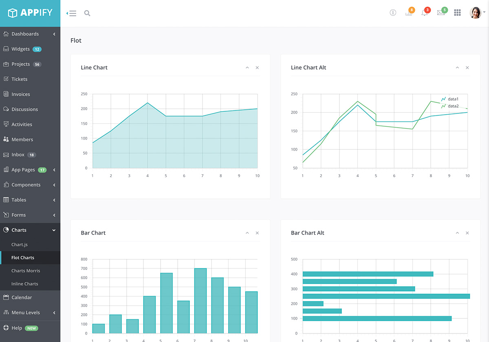
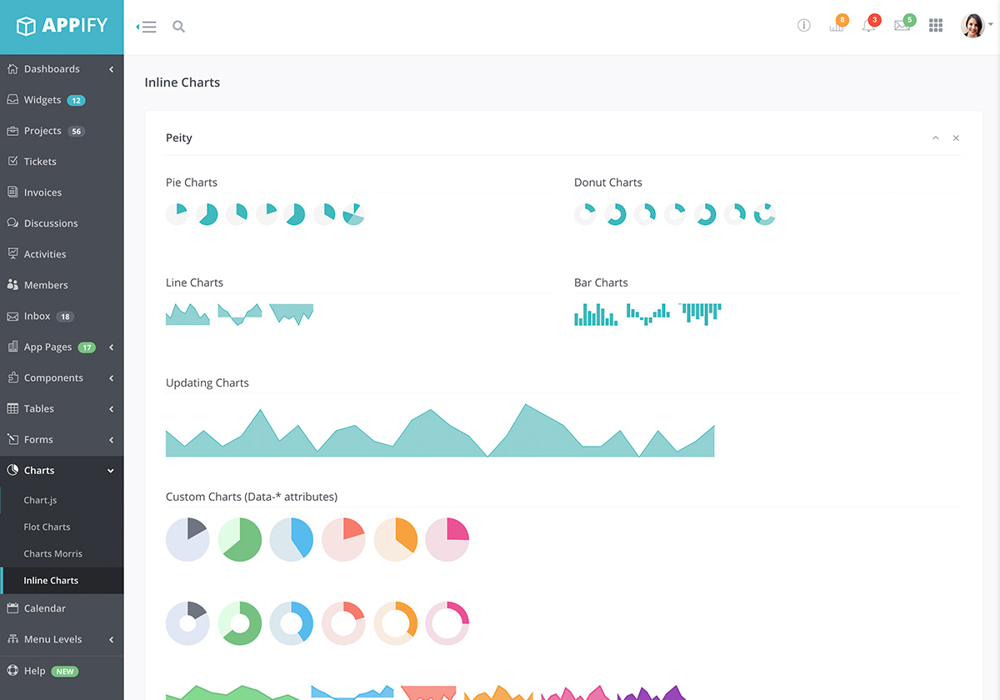

[ PrettyDocs](index.html)
============================================================================================================================================================

1.  [Home](index.html)
2.  Charts

 Charts
========================================================================

Last updated: Oct 12th, 2020

Chart.js
--------

### 1. Screenshot

The screenshots used in this page are taken from [Appify](https://themes.3rdwavemedia.com/bootstrap-templates/product/appify-bootstrap-4-admin-template-for-app-developers/). Appify is a Bootstrap 4 admin template made for app developers.

 <a href="https://themes.3rdwavemedia.com/bootstrap-templates/product/appify-bootstrap-4-admin-template-for-app-developers/" class="mask"><em></em></a>

### 2. Global Configurations

** Source:** <https://www.chartjs.org/docs/>

    Chart.defaults.global = {
        // Boolean - Whether to animate the chart
        animation: true,

        // Number - Number of animation steps
        animationSteps: 60,

        // String - Animation easing effect
        // Possible effects are:
        // [easeInOutQuart, linear, easeOutBounce, easeInBack, easeInOutQuad,
        //  easeOutQuart, easeOutQuad, easeInOutBounce, easeOutSine, easeInOutCubic,
        //  easeInExpo, easeInOutBack, easeInCirc, easeInOutElastic, easeOutBack,
        //  easeInQuad, easeInOutExpo, easeInQuart, easeOutQuint, easeInOutCirc,
        //  easeInSine, easeOutExpo, easeOutCirc, easeOutCubic, easeInQuint,
        //  easeInElastic, easeInOutSine, easeInOutQuint, easeInBounce,
        //  easeOutElastic, easeInCubic]
        animationEasing: "easeOutQuart",

        // Boolean - If we should show the scale at all
        showScale: true,

        // Boolean - If we want to override with a hard coded scale
        scaleOverride: false,

        // ** Required if scaleOverride is true **
        // Number - The number of steps in a hard coded scale
        scaleSteps: null,
        // Number - The value jump in the hard coded scale
        scaleStepWidth: null,
        // Number - The scale starting value
        scaleStartValue: null,

        // String - Colour of the scale line
        scaleLineColor: "rgba(0,0,0,.1)",

        // Number - Pixel width of the scale line
        scaleLineWidth: 1,

        // Boolean - Whether to show labels on the scale
        scaleShowLabels: true,

        // Interpolated JS string - can access value
        scaleLabel: "<%=value%>",

        // Boolean - Whether the scale should stick to integers, not floats even if drawing space is there
        scaleIntegersOnly: true,

        // Boolean - Whether the scale should start at zero, or an order of magnitude down from the lowest value
        scaleBeginAtZero: false,

        // String - Scale label font declaration for the scale label
        scaleFontFamily: "'Helvetica Neue', 'Helvetica', 'Arial', sans-serif",

        // Number - Scale label font size in pixels
        scaleFontSize: 12,

        // String - Scale label font weight style
        scaleFontStyle: "normal",

        // String - Scale label font colour
        scaleFontColor: "#666",

        // Boolean - whether or not the chart should be responsive and resize when the browser does.
        responsive: false,

        // Boolean - whether to maintain the starting aspect ratio or not when responsive, if set to false, will take up entire container
        maintainAspectRatio: true,

        // Boolean - Determines whether to draw tooltips on the canvas or not
        showTooltips: true,

        // Function - Determines whether to execute the customTooltips function instead of drawing the built in tooltips (See [Advanced - External Tooltips](#advanced-usage-custom-tooltips))
        customTooltips: false,

        // Array - Array of string names to attach tooltip events
        tooltipEvents: ["mousemove", "touchstart", "touchmove"],

        // String - Tooltip background colour
        tooltipFillColor: "rgba(0,0,0,0.8)",

        // String - Tooltip label font declaration for the scale label
        tooltipFontFamily: "'Helvetica Neue', 'Helvetica', 'Arial', sans-serif",

        // Number - Tooltip label font size in pixels
        tooltipFontSize: 14,

        // String - Tooltip font weight style
        tooltipFontStyle: "normal",

        // String - Tooltip label font colour
        tooltipFontColor: "#fff",

        // String - Tooltip title font declaration for the scale label
        tooltipTitleFontFamily: "'Helvetica Neue', 'Helvetica', 'Arial', sans-serif",

        // Number - Tooltip title font size in pixels
        tooltipTitleFontSize: 14,

        // String - Tooltip title font weight style
        tooltipTitleFontStyle: "bold",

        // String - Tooltip title font colour
        tooltipTitleFontColor: "#fff",

        // Number - pixel width of padding around tooltip text
        tooltipYPadding: 6,

        // Number - pixel width of padding around tooltip text
        tooltipXPadding: 6,

        // Number - Size of the caret on the tooltip
        tooltipCaretSize: 8,

        // Number - Pixel radius of the tooltip border
        tooltipCornerRadius: 6,

        // Number - Pixel offset from point x to tooltip edge
        tooltipXOffset: 10,

        // String - Template string for single tooltips
        tooltipTemplate: "<%if (label){%><%=label%>: <%}%><%= value %>",

        // String - Template string for multiple tooltips
        multiTooltipTemplate: "<%= value %>",

        // Function - Will fire on animation progression.
        onAnimationProgress: function(){},

        // Function - Will fire on animation completion.
        onAnimationComplete: function(){}
    }

Flot Charts
-----------

### 1. Screenshot

 <a href="https://themes.3rdwavemedia.com/bootstrap-templates/product/appify-bootstrap-4-admin-template-for-app-developers/" class="mask"><em></em></a>

### 2. Basic Usage

** Source:** <https://github.com/flot/flot/blob/master/README.md>

Create a placeholder div to put the graph in:

    

You need to set the width and height of this div, otherwise the plot library doesn't know how to scale the graph. You can do it inline like this:

    

You can also do it with an external stylesheet. Make sure that the placeholder isn't within something with a display:none CSS property - in that case, Flot has trouble measuring label dimensions which results in garbled looks and might have trouble measuring the placeholder dimensions which is fatal (it'll throw an exception).

Then when the div is ready in the DOM, which is usually on document ready, run the plot function:

    $.plot($("#placeholder"), data, options);

Here, data is an array of data series and options is an object with settings if you want to customize the plot. Take a look at the examples for some ideas of what to put in or look at the [API reference](#). Here's a quick example that'll draw a line from (0, 0) to (1, 1):

    $.plot($("#placeholder"), [ [[0, 0], [1, 1]] ], { yaxis: { max: 1 } });

The plot function immediately draws the chart and then returns a plot object with a couple of methods.

Morris.js
---------

### 1. Screenshot

 <a href="https://themes.3rdwavemedia.com/bootstrap-templates/product/appify-bootstrap-4-admin-template-for-app-developers/" class="mask"><em></em></a>

### 2. Getting Started

Add **morris.js** and its dependencies ([jQuery](#) & [Raphaël](#)) to your page.

    1 <link rel="stylesheet" href="//cdnjs.cloudflare.com/ajax/libs/morris.js/0.5.1/morris.css">
    2 
    3 
    4 

### 3. Your first chart

Start by adding a `
` to your page that will contain your chart. Make sure it has an ID so you can refer to it in your Javascript later.

    

#### Note:

in order to display something, you’ll need to have given the div some dimensions. Here I’ve used inline CSS just for illustration.

Next add a `<script>` block to the end of your page, containing the following javascript code:

    new Morris.Line({
      // ID of the element in which to draw the chart.
      element: 'myfirstchart',
      // Chart data records -- each entry in this array corresponds to a point on
      // the chart.
      data: [
        { year: '2008', value: 20 },
        { year: '2009', value: 10 },
        { year: '2010', value: 5 },
        { year: '2011', value: 5 },
        { year: '2012', value: 20 }
      ],
      // The name of the data record attribute that contains x-values.
      xkey: 'year',
      // A list of names of data record attributes that contain y-values.
      ykeys: ['value'],
      // Labels for the ykeys -- will be displayed when you hover over the
      // chart.
      labels: ['Value']
    });

Inline Charts
-------------

### 1. Screenshot

 <a href="https://themes.3rdwavemedia.com/bootstrap-templates/product/appify-bootstrap-4-admin-template-for-app-developers/" class="mask"><em></em></a>

### 2. Charts Used

Lorem ipsum dolor sit amet, consectetuer adipiscing elit. Aenean commodo ligula eget dolor. Aenean massa. Cum sociis natoque penatibus et magnis dis parturient montes, nascetur ridiculus mus. Donec quam felis, ultricies nec, pellentesque eu, pretium quis, sem. Nulla consequat massa quis enim.

-   [ Peity](#)
-   [ Easy Pie Chart](#)
-   [ Sparklines](#)

Jumbotron Example
=================

Lorem ipsum dolor sit amet, consectetuer adipiscing elit. Aenean commodo ligula eget dolor. Aenean massa. Cum sociis natoque penatibus et magnis dis parturient montes, nascetur ridiculus mus. Donec quam felis, ultricies nec, pellentesque eu, pretium quis, sem. Nulla consequat massa quis enim.

-   <a href="https://themes.3rdwavemedia.com/bootstrap-templates/product/appify-bootstrap-4-admin-template-for-app-developers/" class="btn btn-cta btn-pink"><em></em> Appify Details</a>
-   <a href="https://themes.3rdwavemedia.com/bootstrap-templates/product/appify-bootstrap-4-admin-template-for-app-developers/" class="btn btn-cta btn-primary"><em></em> Appify Demo</a>

<a href="#chartjs" class="nav-link scrollto">Chart.js</a> <a href="#flot" class="nav-link scrollto">Flot Charts</a> <a href="#morris" class="nav-link scrollto">Morris.js</a> <a href="#inline" class="nav-link scrollto">Inline Charts</a>

###  [Are you an ambitious and entrepreneurial developer?](https://themes.3rdwavemedia.com/bootstrap-templates/portfolio/instance-bootstrap-portfolio-theme-for-developers/)

 <a href="https://themes.3rdwavemedia.com/bootstrap-templates/portfolio/instance-bootstrap-portfolio-theme-for-developers/" class="mask"><em></em></a>

#### **Instance - Bootstrap 4 Portfolio Theme for Aspiring Developers**

Check out [Instance](https://themes.3rdwavemedia.com/bootstrap-templates/portfolio/instance-bootstrap-portfolio-theme-for-developers/) - a Bootstrap personal portfolio theme I created for developers. The UX design is focused on selling a developer’s skills and experience to potential employers or clients, and has **all the winning ingredients to get you hired**. It’s not only a HTML site template but also a marketing framework for you to **build an impressive online presence with a high conversion rate**.

**\[Tip for developers\]:** If your project is Open Source, you can use this area to promote your other projects or hold third party adverts like Bootstrap and FontAwesome do!

<a href="https://themes.3rdwavemedia.com/bootstrap-templates/portfolio/instance-bootstrap-portfolio-theme-for-developers/" class="btn btn-cta"><em></em> View Demo</a>

[Xiaoying Riley](https://themes.3rdwavemedia.com)

. :) If you'd like to use the template without the attribution, you can buy the commercial license via our website: themes.3rdwavemedia.com \*/--&gt; Designed with by [Xiaoying Riley](https://themes.3rdwavemedia.com/) for developers
