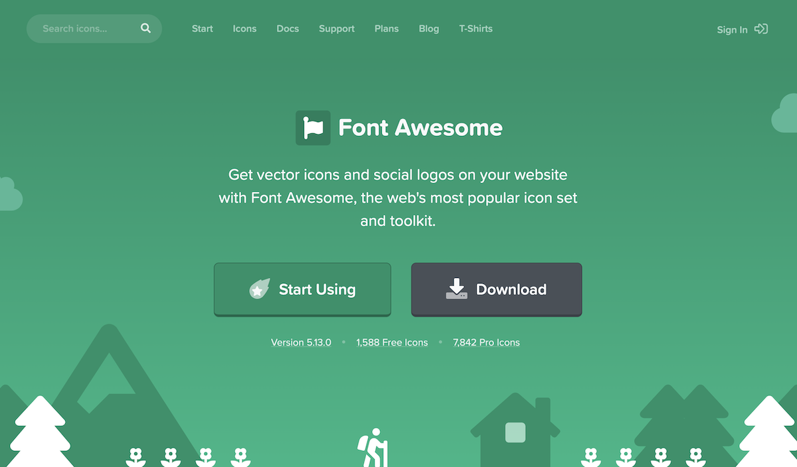

[ PrettyDocs](index.html)
============================================================================================================================================================

1.  [Home](index.html)
2.  Quick Start

 Quick Start
===========

Last updated: Oct 12th, 2020

Download
--------

Lorem ipsum dolor sit amet, consectetur adipiscing elit. Morbi nec imperdiet turpis. Curabitur aliquet pulvinar ultrices. Etiam at posuere leo. Proin ultrices ex et dapibus feugiat [link example](#) aenean purus leo, faucibus at elit vel, aliquet scelerisque dui. Etiam quis elit euismod, imperdiet augue sit amet, imperdiet odio. Aenean sem erat, hendrerit eu gravida id, dignissim ut ante. Nam consequat porttitor libero euismod congue.

<a href="https://themes.3rdwavemedia.com/bootstrap-templates/startup/prettydocs-free-bootstrap-theme-for-developers-and-startups/" class="btn btn-green"><em></em> Download PrettyDocs</a>

Installation
------------

### Step One

Lorem ipsum dolor sit amet, consectetuer adipiscing elit. Aenean commodo ligula eget dolor. Aenean massa. Cum sociis natoque penatibus et magnis dis parturient montes, nascetur ridiculus mus. Donec quam felis.

###### Default code example:

`bower install <package>`

`npm install <package>`

### Step Two

Lorem ipsum dolor sit amet, consectetuer adipiscing elit. Aenean commodo ligula eget dolor. Aenean massa.

###### Un-ordered list example

-   Lorem ipsum dolor sit amet.
-   Aliquam tincidunt mauris.
-   Ultricies eget vel aliquam libero.
    -   Turpis pulvinar
    -   Feugiat scelerisque
    -   Ut tincidunt
-   Pellentesque habitant morbi.
-   Praesent dapibus, neque id.

###### Ordered list example

1.  Lorem ipsum dolor sit amet.
2.  Aliquam tincidunt mauris.
3.  Ultricies eget vel aliquam libero.
    -   Turpis pulvinar
    -   Feugiat scelerisque
    -   Ut tincidunt
4.  Pellentesque habitant morbi.
5.  Praesent dapibus, neque id.

### Step Three

Lorem ipsum dolor sit amet, consectetuer adipiscing elit. Aenean commodo ligula eget dolor. Aenean massa. Cum sociis natoque penatibus et magnis dis parturient montes, nascetur ridiculus mus. Donec quam felis.

Code
----

[PrismJS](https://prismjs.com/) is used as the syntax highlighter here. You can [build your own version](https://prismjs.com/download.html) via their website should you need to.

#### Useful Tip:

You can use this online [HTML entity encoder/decoder](https://mothereff.in/html-entities) to generate your code examples.

###### HTML Code Example

    <!DOCTYPE html> 
    <html lang="en"> 
        ...
        
 
            <h1>Hello, world!</h1> 
            
...
 
            
<a class="btn btn-primary btn-lg" href="#" role="button">Learn more</a>
 
        

        
 
            <h1>Hello, world!</h1> 
            
...
 
            
<a class="btn btn-primary btn-lg" href="#" role="button">Learn more</a>
 
        

        ...
    </html>

###### CSS Code Example

    /* ======= Base Styling ======= */
    body {
        font-family: 'Open Sans', arial, sans-serif; 
        color: #333; 
        font-size: 16px; 
        -webkit-font-smoothing: antialiased; 
        -moz-osx-font-smoothing: grayscale; 
    }

###### SCSS Code Example

    @mixin transform($property) {
      -webkit-transform: $property;
          -ms-transform: $property;
              transform: $property;
    }

    .box { @include transform(rotate(30deg)); }

###### LESS Code Example

    @base: #f04615;
    @width: 0.5;

    .class {
      width: percentage(@width); // returns `50%`
      color: saturate(@base, 5%);
      background-color: spin(lighten(@base, 25%), 8);
    }

###### JavaScript Code Example

    

###### Python Code Example

    >>> x = int(input("
    Please enter an integer: ")) Please enter an integer: 42 
    >>> if x < 0: 
    ... x = 0 
    ... print('Negative changed to zero') 
    ... elif x == 0: 
    ... print('Zero') 
    ... elif x == 1: 
    ... print('Single') 
    ... else: 
    ... print('More') 
    ... More

###### PHP Code Example

    <?php 
    $txt = "Hello world!"; 
    $x = 5; 
    $y = 10.5; 

    echo $txt; 
    echo " "; 
    echo $x; 
    echo " "; 
    echo $y; 
    ?>

###### Handlebars Code Example

    Handlebars.registerHelper('list', function(items, options) { 
      var out = "<ul>"; 
      
      for(var i=0, l=items.length; i<l; i++) { 
        out = out + "<li>" + options.fn(items[i]) + "</li>"; 
      } 
      
      return out + "</ul>"; 
    });

###### Git Code Example

    $ git add Documentation.txt

Callouts
--------

Lorem ipsum dolor sit amet, consectetuer adipiscing elit. Aenean commodo ligula eget dolor. Aenean massa. Cum sociis natoque penatibus et magnis dis parturient montes, nascetur ridiculus mus. Donec quam felis, ultricies nec, pellentesque eu, pretium quis, sem. Nulla consequat massa quis enim. Donec pede justo, fringilla vel, aliquet nec, vulputate eget, arcu. In enim justo, rhoncus ut, imperdiet a, venenatis vitae, justo.

#### Aenean imperdiet

Sed ut perspiciatis unde omnis iste natus error sit voluptatem accusantium `<code>` , Nemo enim ipsam voluptatem quia voluptas [link example](#) sit aspernatur aut odit aut fugit.

#### Morbi posuere

Nunc hendrerit odio quis dignissim efficitur. Proin ut finibus libero. Morbi posuere fringilla felis eget sagittis. Fusce sem orci, cursus in tortor [link example](#) tellus vel diam viverra elementum.

#### Lorem ipsum dolor sit amet

Lorem ipsum dolor sit amet, consectetuer adipiscing elit. [Link example](#) aenean commodo ligula eget dolor.

#### Interdum et malesuada

Morbi eget interdum sapien. Donec sed turpis sed nulla lacinia accumsan vitae ut tellus. Aenean vestibulum [Link example](#) maximus ipsum vel dignissim. Morbi ornare elit sit amet massa feugiat, viverra dictum ipsum pellentesque.

Tables
------

Lorem ipsum dolor sit amet, consectetuer adipiscing elit. Aenean commodo ligula eget dolor. Aenean massa. Cum sociis natoque penatibus et magnis dis parturient montes, nascetur ridiculus mus. Donec quam felis.

###### Basic Table

<table><thead><tr class="header"><th>#</th><th>First Name</th><th>Last Name</th><th>Username</th></tr></thead><tbody><tr class="odd"><td>1</td><td>Mark</td><td>Otto</td><td>@mdo</td></tr><tr class="even"><td>2</td><td>Jacob</td><td>Thornton</td><td>@fat</td></tr><tr class="odd"><td>3</td><td>Larry</td><td>the Bird</td><td>@twitter</td></tr></tbody></table>

###### Striped Table

<table><thead><tr class="header"><th>#</th><th>First Name</th><th>Last Name</th><th>Username</th></tr></thead><tbody><tr class="odd"><td>1</td><td>Mark</td><td>Otto</td><td>@mdo</td></tr><tr class="even"><td>2</td><td>Jacob</td><td>Thornton</td><td>@fat</td></tr><tr class="odd"><td>3</td><td>Larry</td><td>the Bird</td><td>@twitter</td></tr></tbody></table>

###### Bordered Table

<table><thead><tr class="header"><th>#</th><th>First Name</th><th>Last Name</th><th>Username</th></tr></thead><tbody><tr class="odd"><td>1</td><td>Mark</td><td>Otto</td><td>@mdo</td></tr><tr class="even"><td>2</td><td>Jacob</td><td>Thornton</td><td>@fat</td></tr><tr class="odd"><td>3</td><td>Larry</td><td>the Bird</td><td>@twitter</td></tr></tbody></table>

Buttons
-------

Lorem ipsum dolor sit amet, consectetur adipiscing elit. Morbi nec imperdiet turpis. Curabitur aliquet pulvinar ultrices. Etiam at posuere leo. Proin ultrices ex et dapibus feugiat [link example](#) aenean purus leo, faucibus at elit vel, aliquet scelerisque dui. Etiam quis elit euismod, imperdiet augue sit amet, imperdiet odio. Aenean sem erat, hendrerit eu gravida id, dignissim ut ante. Nam consequat porttitor libero euismod congue.

###### Basic Buttons

-   <a href="#" class="btn btn-primary">Primary Button</a>
-   <a href="#" class="btn btn-green">Green Button</a>
-   <a href="#" class="btn btn-blue">Blue Button</a>
-   <a href="#" class="btn btn-orange">Orange Button</a>
-   <a href="#" class="btn btn-red">Red Button</a>

###### CTA Buttons

-   <a href="#" class="btn btn-primary btn-cta"><em></em> Download Now</a>
-   <a href="#" class="btn btn-green btn-cta"><em></em> Fork Now</a>
-   <a href="#" class="btn btn-blue btn-cta"><em></em> Find Out Now</a>
-   <a href="#" class="btn btn-orange btn-cta"><em></em> Report Bugs</a>
-   <a href="#" class="btn btn-red btn-cta"><em></em> Submit Issues</a>

Video
-----

###### Responsive Video 16:9

###### Responsive Video 4:3

Icons
-----

Lorem ipsum dolor sit amet, consectetur adipiscing elit. Morbi nec imperdiet turpis. Curabitur aliquet pulvinar ultrices. Etiam at posuere leo. Proin ultrices ex et dapibus feugiat [link example](#) aenean purus leo, faucibus at elit vel, aliquet scelerisque dui. Etiam quis elit euismod, imperdiet augue sit amet, imperdiet odio. Aenean sem erat, hendrerit eu gravida id, dignissim ut ante. Nam consequat porttitor libero euismod congue.

###### Elegant Icon Font

###### FontAwesome Icon Font

<a href="#download-section" class="nav-link scrollto">Download</a> <a href="#installation-section" class="nav-link scrollto">Installation</a> <a href="#step1" class="nav-link scrollto">Step One</a> <a href="#step2" class="nav-link scrollto">Step Two</a> <a href="#step3" class="nav-link scrollto">Step Three</a> <a href="#code-section" class="nav-link scrollto">Code</a> <a href="#html" class="nav-link scrollto">HTML</a> <a href="#css" class="nav-link scrollto">CSS</a> <a href="#sass" class="nav-link scrollto">Sass</a> <a href="#less" class="nav-link scrollto">LESS</a> <a href="#javascript" class="nav-link scrollto">JavaScript</a> <a href="#python" class="nav-link scrollto">Python</a> <a href="#php" class="nav-link scrollto">PHP</a> <a href="#handlebars" class="nav-link scrollto">Handlebars</a> <a href="#callouts-section" class="nav-link scrollto">Callouts</a> <a href="#tables-section" class="nav-link scrollto">Tables</a> <a href="#buttons-section" class="nav-link scrollto">Buttons</a> <a href="#video-section" class="nav-link scrollto">Video</a> <a href="#icons-section" class="nav-link scrollto">Icons</a>

###  [Are you an ambitious and entrepreneurial developer?](https://themes.3rdwavemedia.com/bootstrap-templates/portfolio/instance-bootstrap-portfolio-theme-for-developers/)

 <a href="https://themes.3rdwavemedia.com/bootstrap-templates/portfolio/instance-bootstrap-portfolio-theme-for-developers/" class="mask"><em></em></a>

#### **Instance - Bootstrap 4 Portfolio Theme for Aspiring Developers**

Check out [Instance](https://themes.3rdwavemedia.com/bootstrap-templates/portfolio/instance-bootstrap-portfolio-theme-for-developers/) - a Bootstrap personal portfolio theme I created for developers. The UX design is focused on selling a developer’s skills and experience to potential employers or clients, and has **all the winning ingredients to get you hired**. It’s not only a HTML site template but also a marketing framework for you to **build an impressive online presence with a high conversion rate**.

**\[Tip for developers\]:** If your project is Open Source, you can use this area to promote your other projects or hold third party adverts like Bootstrap and FontAwesome do!

<a href="https://themes.3rdwavemedia.com/bootstrap-templates/portfolio/instance-bootstrap-portfolio-theme-for-developers/" class="btn btn-cta"><em></em> View Demo</a>

[Xiaoying Riley](https://themes.3rdwavemedia.com)

Designed with by [Xiaoying Riley](https://themes.3rdwavemedia.com/) for developers
