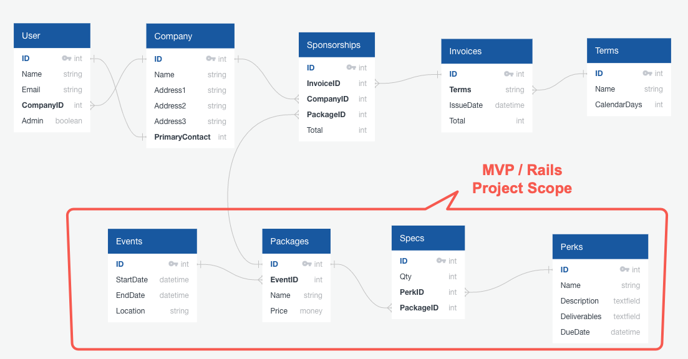

Sponsorships
============

The Sponsorships app is designed to help Event Planners organize their sponsorship packages across events. Create as many different events, sponsorships, perks and configurations as you need.

### Getting Up and Running

Clone the Babies at Work repo to your local machine.

Once the app is on your machine, run `bundle` from the project directory to install the neccessary gems. Then, run `rails s` from the project directory to start the server. Last, in a modern browser, navigate to http://localhost:3000.

### Contributing

Bug reports and pull requests are welcome on GitHub at https://github.com/wifelette/flatiron-project-3.

This project is intended to be a safe, welcoming space for collaboration, and contributors are expected to adhere to the Contributor Covenant code of conduct.

### License

This project is licensed under the MIT License - see the [LICENSE.md](LICENSE.md) file for details

Design / Planning
-----------------

