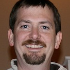

-   [Home](index.html)
-   [Speakers](speakers.html)
-   [Schedule](schedule.html)
-   [Sponsors](sponsors.html)
-   [Community](community.html)
-   [Location](location.html)
-   [Resources](resources.html)

### Platinum Sponsors

 

### Gold Sponsors

 

### Silver Sponsors

  
  

### Bronze Sponsors

  
  

Interested in Sponsoring GoGaRuCo?

<a href="" id="sponsorbutton">Download the Prospectus</a>

or contact [Leah Silber](#) for more info!

Conference Team
===============

Golden Gate Ruby Conference is a production of Golden Gate Ruby Conference, LLC.  
Your conference organizers are:

#### Leah Silber

If you've been to a Ruby or jQuery conference in the last few years, you've likely seen Leah there. When she's not traveling the world seeking out the perfect conference, she's here in San Francisco working on other open source community projects, like the Ruby Summer of Code. She is currently employed by appendTo.

#### Josh Susser

Josh likes to say that Ruby is the love child of Lisp and Smalltalk, raised by Perl the eccentric nanny. At Pivotal Labs he spends most of his time developing Rails web applications for clients, and he is a high-ranked contributor to the Rails open source project. He has spoken at RailsConf, regional conferences and meetups. In past lives he's done Smalltalk VM implementation, spent too much time at Apple building the ill-fated OpenDoc, and helped design the Java VM that runs on the SIM card in your iPhone. You can find his blog at blog.hasmanythrough.com.

#### Jim Meyer

Jim Meyer (@purp) is a perpetual n00b who blames both Ruby and Rails for his sleep deficit dating back to May of ‘07. He’s particularly delighted to join a community where agility is valued, iteration is key, and testing is cool.

With a career that’s ranged from freelance graphic design to large scale distributed computing systems architecture to leading technology organizations large and small, Jim is a renaissance man, a geek of all trades, or (most likely) an advanced case of ADD in search of the next challenging distraction. Along the way, he’s founded a graphic design studio, built technology groups and solutions for the likes of Disney and DreamWorks, met many interesting people and had a metric ton of fun.

Jim is the father of two and husband of one, all three of whom make him a better person on a daily basis (and none of whom speak in third person).

#### Follow Us

  
  

#### Contact Us

General Inquiries: <conference@gogaruco.com> | Sponsorship Inquiries: <sponsors@gogaruco.com>

© 2011 golden gate ruby conference, llc [Home](index.html) | [Speakers](speakers.html) | [Schedule](schedule.html) | [Sponsors](sponsors.html) | [Community](community.html) | [Locations](locations.html) | [Resources](resources.html) [\[2009\]](#) [\[2010\]](#)
