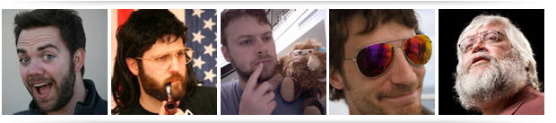
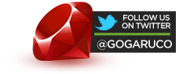
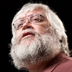

-   [Home](index.html)
-   [Speakers](speakers.html)
-   [Schedule](schedule.html)
-   [Sponsors](sponsors.html)
-   [Community](community.html)
-   [Location](location.html)
-   [Resources](resources.html)

### Platinum Sponsors

 

### Gold Sponsors

 

### Silver Sponsors

  
  

### Bronze Sponsors

  
  

Interested in Sponsoring GoGaRuCo?

<a href="" id="sponsorbutton">Download the Prospectus</a>

or contact [Leah Silber](#) for more info!

Welcome To Golden Gate Ruby Conf 2011
=====================================

San Francisco is the birthplace of the web revolution. Ruby powers many new technologies, from web sites to telephony and desktop applications. Join us for two days of in-depth technical explorations of the most interesting parts of the Ruby landscape, presented by some of the top talents in the Ruby development community.

Registration for the second annual Golden Gate Ruby Conference is open now! Your ticket to Golden Gate Ruby Conference gets you the following:

-   • Admission to two days of sessions

-   • Breakfast and Lunch both days

-   • Official Conference swag

-   • Entry into event giveaway raffles

-   • Access to any after-hours events

-   • Access to our fantastic attendees and speakers

The conference is single-track, and we're capping it at 300 people to keep things intimate. Just like last year we're doing 30-minute sessions so talks stay focused and interesting, with long breaks to allow time for networking and discussion. And if you want to see what things were like last year, check out the 2009 edition of our zine, the Golden Gate Ruby Wrap.

See you all there!

Event Updates
=============

**Keynote Speaker: Jim Weirich**  
Posted June 13, 2011

If you've done anything in Ruby, you've used software written by Jim Weirich. Jim is known on the Ruby conference circuit for being a great speaker — informative, entertaining, inspiring. What more could you want? We're thrilled to announce Jim will be delivering our keynote session. For details, stay tuned for the program announcements next week.

**New Location and Dates Announced**  
Posted June 16, 2011

After last year's smashing success, we knew it was time to grow! After a long and arduous search, we've got our new dates and venue all settled up: we'll be at the beautiful Mission Bay Conference Center at UCSF on September 17 and 18. The facilities are state of the art with plentiful power and comfortable seating, the location is just a short MUNI ride from downtown, and it can accommodate a bigger batch of attendees.

© 2011 golden gate ruby conference, llc [Home](index.html) | [Speakers](speakers.html) | [Schedule](schedule.html) | [Sponsors](sponsors.html) | [Community](community.html) | [Locations](locations.html) | [Resources](resources.html) [\[2009\]](#) [\[2010\]](#)
