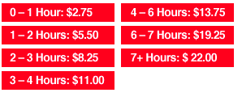

-   [Home](index.html)
-   [Speakers](speakers.html)
-   [Schedule](schedule.html)
-   [Sponsors](sponsors.html)
-   [Community](community.html)
-   [Location](location.html)
-   [Resources](resources.html)

### Platinum Sponsors

 

### Gold Sponsors

 

### Silver Sponsors

  
  

### Bronze Sponsors

  
  

Interested in Sponsoring GoGaRuCo?

<a href="" id="sponsorbutton">Download the Prospectus</a>

or contact [Leah Silber](#) for more info!

Location
========

**Mission Bay Conference Center at UCSF**  
  
1675 Owens Street San Francisco, CA 94143-3008

  
[View Larger Map](http://maps.google.com/maps?client=safari&q=1675+Owens+Street+San+Francisco,+CA+94143-3008&oe=UTF-8&ie=UTF8&hq=&hnear=1675+Owens+St,+San+Francisco,+California+94158&gl=us&t=h&z=14&ll=37.767832,-122.394186&source=embed)  
  

#### Public Transportation

**MUNI:** The T-Third Metro Line picks up at the 4th and King Street Caltrain Station as well as the Embarcadero, Montgomery or Powell MUNI/BART stations. The appropriate stop is the UCSF Mission Bay Station on 3rd Street opposite the campus.

**BART:** Disembark at the “16th Street Mission” BART station. From this point, pick up the Red Line UCSF shuttle in front of the Burger King on the North-East corner of the intersection. The shuttle runs every 15 minutes and brings you to the William J. Rutter Center (2nd stop).

#### Parking

There is a paid parking garage located adjacent to the Mission Bay Conference Center. Parking fees can be paid by cash/check at kiosk upon departure or credit/cash/check at the payment window located on the 1st floor of the garage. Rates are as follows:  
  

#### Driving Directions

**Driving from the East Bay/Bay Bridge:** After crossing the Bay Bridge, exit at Fifth Street and turn left onto Harrison. Go one block, then turn left on 6th Street. Turn right on Brannan, left on 7th and go straight until 16th Street. Then turn left on 16th Street and left onto Owens Street.

**Driving from the North Bay/Golden Gate Bridge:** After crossing the Golden Gate Bridge, drive east on 101 (Doyle Drive) towards downtown and exit at Marina Boulevard; follow Marina Boulevard past Fort Mason. Turn left onto Bay Street, then right onto the Embarcadero. After passing under the Bay Bridge, the Embarcadero will become King Street. Turn left onto 3rd Street just past AT&T Baseball Park. Then turn right on 16th Street and right onto Owens Street.

**Driving from the South Bay/SFO:** From 101 North, exit onto Vermont Street, turn right onto 16th Street and continue for 0.6 miles (crossing the railroad tracks that are under the I-280 overpass). Then turn left onto Owens Street.

**From 280 North:** exit at Mariposa Street and turn left. Turn right on Mississippi Street and go two blocks. Then turn right onto 16th Street, and left onto Owens Street.

#### After Party!

Conference Platinum Sponsor Yammer will be hosting a fantastic after party at ThirstyBear Brewing Co, a great local spot in the SOMA part of town.

The party starts at 6:30, and will feature a wide variety of appetizers and snacks, as well as an open bar. A shuttle will be provided from the conference to ThirstyBear for those of you who aren't driving, and, important to note, you WILL need your conference badge to gain entry to the event. Separate registration is not required.

#### Lodging

If you're looking for a place to stay, you might try one of these hotels listed here. There aren't any good places to stay near the conference center, so we recommend staying in the Union Square / Downtown area. It's easy to take MUNI to the conference from any of the Market Street subway stations.

GoGaRuCo has no official connection to any of these hotels, and there is no conference rate being offered. We're just providing this list as a convenience to help visitors.

  
  

© 2011 golden gate ruby conference, llc [Home](index.html) | [Speakers](speakers.html) | [Schedule](schedule.html) | [Sponsors](sponsors.html) | [Community](community.html) | [Locations](locations.html) | [Resources](resources.html) [\[2009\]](#) [\[2010\]](#)
