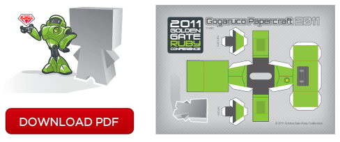
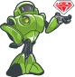

-   [Home](index.html)
-   [Speakers](speakers.html)
-   [Schedule](schedule.html)
-   [Sponsors](sponsors.html)
-   [Community](community.html)
-   [Location](location.html)
-   [Resources](resources.html)

### Platinum Sponsors

 

### Gold Sponsors

 

### Silver Sponsors

  
  

### Bronze Sponsors

  
  

Interested in Sponsoring GoGaRuCo?

<a href="" id="sponsorbutton">Download the Prospectus</a>

or contact [Leah Silber](#) for more info!

Resources
=========

**GoGaRuCo 2011 Papercraft**  
  
Make your own papercraft GoGaRuCo Bot by downloading the PDF and following the simple instructions. Gluing your fingers together has never been this fun!

© 2011 golden gate ruby conference, llc [Home](index.html) | [Speakers](speakers.html) | [Schedule](schedule.html) | [Sponsors](sponsors.html) | [Community](community.html) | [Locations](locations.html) | [Resources](resources.html) [\[2009\]](#) [\[2010\]](#)
