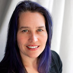
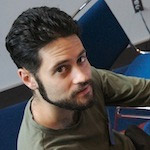

-   [Home](index.html)
-   [Speakers](speakers.html)
-   [Schedule](schedule.html)
-   [Sponsors](sponsors.html)
-   [Community](community.html)
-   [Location](location.html)
-   [Resources](resources.html)

### Platinum Sponsors

 

### Gold Sponsors

 

### Silver Sponsors

  
  

### Bronze Sponsors

  
  

Interested in Sponsoring GoGaRuCo?

<a href="" id="sponsorbutton">Download the Prospectus</a>

or contact [Leah Silber](#) for more info!

Speakers & Panelists
====================

#### Jim Weirich

EdgeCase LLC **Keynote: (Parenthetically Speaking)**

Jim Weirich is the Chief Scientist for EdgeCase LLC, a Rails development firm located in Columbus Ohio. Jim has over twenty-five years of experience in software development. He has worked with real-time data systems for testing jet engines, networking software for information systems, and image processing software for the financial industry. Jim is active in the Ruby community and has contributed to several Ruby projects, including the Rake build system and the RubyGems package software.

#### Sarah Allen

Blazing Cloud **Session: Test-First Teaching**

Sarah leads a small consulting group, Blazing Cloud, and is working on a mobile-focused startup, Mightyverse. She regularly teaches Ruby and Rails with a test-first approach. In her spare time, Sarah works to diversify the Ruby on Rails community with a focus on outreach to women through the RailsBridge Open Workshop project. In keeping with her belief that programming is a life skill, she also regularly volunteers teaching programming to kids. Sarah used to be active on the OpenLaszlo core team before she became distracted with Ruby. You can blame her for some of the web's most annoying and least testable features, since she was largely responsible for bringing Shockwave and Flash video into the world. She blogs at ultrasaurus.com and tweets as @ultrasaurus.

#### Avi Bryant

Smallthought **Session: Rails is Obsolete (But So's Everything Else)**

Avi Bryant spoke at the first RubyConf, in 2001, then wandered away for a decade to help build a web framework (Seaside), product (Dabble DB) and company (Smallthought) on top of Smalltalk. When Smallthought was acquired by Twitter, he was abruptly pulled back to both Ruby and the Bay Area, and looks forward to enjoying both.

© 2011 golden gate ruby conference, llc [Home](index.html) | [Speakers](speakers.html) | [Schedule](schedule.html) | [Sponsors](sponsors.html) | [Community](community.html) | [Locations](locations.html) | [Resources](resources.html) [\[2009\]](#) [\[2010\]](#)
